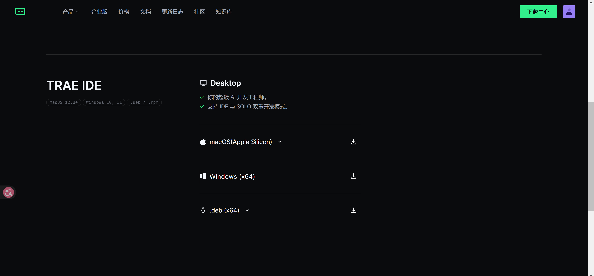

# 从这里开始：用 PPT Master 生成可编辑 PPT

这份文档给第一次接触开源 Skill 的普通用户看。你不需要先研究 GitHub，也不需要理解 PPT Master 的内部结构。

你只要完成三件事：

1. 把材料放进 `inputs/`。
2. 用 Trae 打开这个文件夹，复制 `prompts/normal-use.txt` 里的提示词。
3. 等它生成 `.pptx`，然后检查结果。

## 第 0 步：准备一个固定工作区

建议先建一个专门放 AI Skill 的文件夹。不要放在系统目录，也不要放在微信、QQ、网盘同步目录里。

Windows 推荐：

```text
C:\Users\你的用户名\Documents\ai-skills\
```

或者：

```text
D:\ai-skills\
```

macOS 推荐：

```text
~/Documents/ai-skills/
```

然后把这个 starter 放进去，最后像这样：

```text
ai-skills/
└── ppt-master-starter/
    ├── START_HERE.md
    ├── inputs/
    ├── outputs/
    ├── prompts/
    ├── samples/
    └── scripts/
```

为什么要这样放：

- 路径短一点，少出错。
- 以后每次用都能找到。
- 不容易和正式工作文件混在一起。
- Trae 打开整个文件夹时，能看到 `inputs/`、`prompts/` 和 `samples/`。

## 第 1 步：安装 Trae

这份普通人版文档默认使用 Trae。对国内普通用户来说，Trae 有一个好处：如果你的版本支持自定义 API，可以接自己的模型服务，网络和费用选择会更灵活。

安装方式：

1. 打开 Trae 官网：https://www.trae.cn/
2. 点击右上角下载中心
3. 根据您的电脑版本选择下载对应版本的trae ide
4. 按普通软件方式安装。
5. 打开 Trae 并登录。
6. 如果你需要自定义模型 API，先在 Trae 的设置里找到模型或 API 配置，把自己的 API 接好。
7. 在 Trae 里选择 `Open Folder`，打开你的 `ppt-master-starter` 文件夹。

下载中心里大概是这个样子，按你的电脑系统选择对应版本即可：



注意：请打开整个 `ppt-master-starter` 文件夹，不要只打开 `START_HERE.md` 这一个文件。

## 第 2 步：先学会看 Trae 的命令审核

Trae 帮你配置环境时，可能会弹出一条英文命令，让你确认是否运行。

命令本身不能改成中文。`powershell`、`python`、`npx` 这些名字是电脑要识别的指令。

但你不需要硬看英文。不要看不懂就直接点确认。先把命令复制给 Trae Agent，让它用中文解释。

最省事的做法是打开：

```text
prompts/command-review.txt
```

把里面的内容复制给 Trae Agent，再把弹窗里的英文命令粘进去。

复制这段：

```text
请把下面这条英文命令翻译成普通用户能看懂的“中文命令确认卡”。

英文命令：
[把 Trae 弹窗里的命令粘贴到这里]

请按这个格式回答：

命令名称：
原始命令：
这条命令做什么：
是否会联网：
是否会安装东西：
是否会删除或移动文件：
会修改哪个目录：
风险：
是否建议执行：

不要直接运行。等我明确回复“可以执行”以后，你再运行。
```

比如你看到这条：

```powershell
powershell -ExecutionPolicy Bypass -File "c:\Users\Administrator\Desktop\docs\codes\ai-skills-for-everyone\kits\ppt-master-starter\scripts\check-env.ps1"
```

它的意思大概是：用 PowerShell 运行本项目里的环境检查脚本。这个脚本只检查 Python、Node.js、`npx` 和文件夹，不安装东西，也不删除文件。

但你不需要自己判断。让 Trae Agent 解释清楚，再点确认。

## 第 3 步：让 Trae 配置环境

PPT Master 不是纯网页工具。它需要本地环境。

你最终需要这些东西：

- Trae
- Python 3.10 或更高版本
- Node.js 和 `npx`
- 已安装或可安装 PPT Master

但普通用户不需要自己一个个手动装。Trae 装好后，优先让 Trae Agent 帮你检查环境、给出安装命令、等你确认后再执行。

在安装 PPT Master 之前，先让 Trae 问你能不能打开 GitHub。这个问题很重要，因为很多普通用户不一定知道 GitHub 是什么，也不一定能稳定访问。

你应该看到类似这样的提问：

```text
你现在能不能正常打开 GitHub？

请只回复下面一种：
1. 有，GitHub 能正常打开
2. 没有，GitHub 经常打不开
3. 不确定，我不知道 GitHub 是什么
```

如果你打不开 GitHub，或者你不知道 GitHub 是什么，就选第 2 或第 3 个。这样 Trae 不应该直接让你确认 `git clone` 或 `npx skills add` 之类的联网命令，而是应该改成 ZIP 或本地文件夹路线。

ZIP 路线的意思很简单：先拿到 PPT Master 压缩包，解压到固定目录。解压好以后，你只需要把这个文件夹路径告诉 Trae。

如果你本地没有 ZIP，也不知道去哪下，打开：

```text
DOWNLOADS.md
```

里面有 GitHub 官方链接、AtomGit 官方镜像、百度网盘备用链接，也有可以发给别人帮忙下载的清单。

如果你完全打不开 GitHub，先试 AtomGit 官方镜像：

```text
https://atomgit.com/hugohe3/ppt-master
```

打开后点 `克隆/下载`，再点 `下载ZIP`。

如果 AtomGit 也不行，再试百度网盘。网盘也不行，再让别人帮你下载这个固定版本 ZIP：

```text
https://github.com/hugohe3/ppt-master/archive/refs/tags/v2.7.0.zip
```

注意：AtomGit 是 PPT Master 官方 README 列出的镜像；百度网盘只是备用镜像，不是官方来源。下载后一定要先解压，不要直接把 `.zip` 文件路径给 Trae。

如果 Trae 让你回复“可以执行 #3 #2 #4”这种编号，不要直接照抄。让它重新用普通话说明每一步：先做什么、会不会联网、会改哪里、为什么要这么做。

打开：

```text
prompts/bootstrap-env.txt
```

把里面的内容复制给 Trae Agent。

这段提示词会让 Trae Agent 帮你完成三件事：

- 检查 Python、Node.js 和 `npx`。
- 安装或接入 PPT Master。
- 用 `inputs/realistic-ppt-brief.md` 跑一次测试。

如果需要安装 Python、Node.js 或 PPT Master 依赖，它应该先把准备运行的命令列出来，等你确认后再执行。

如果 Trae 弹出英文命令，按第 2 步的方法先让它用中文解释，再决定是否确认。

如果 Trae Agent 装不上，再手动安装：

- Python：https://www.python.org/downloads/
- Node.js LTS：https://nodejs.org/

Windows 安装 Python 时，记得勾选 `Add python.exe to PATH`。安装完成后，重新打开 Trae，再运行环境检查。

PPT Master 原项目在这里：https://github.com/hugohe3/ppt-master

如果你看不懂 Python、Node.js、`npx`，或者 Trae Agent 提示需要执行命令但你不确定是否安全，不要硬扛。你也可以把 `prompts/bootstrap-env.txt` 里的内容发给懂技术的朋友、同事或同学，让他帮你做一次配置。

## 如果 GitHub 打不开

GitHub 打不开时，不建议一上来就试 GitHub 下载。GitHub、npm、PyPI、Trae 登录和模型服务都可能慢，甚至直接失败。

建议按这个顺序处理：

1. 先告诉 Trae：我不确定 GitHub 能不能打开，或者这台电脑经常打不开 GitHub。
2. 让 Trae 先走 ZIP 或本地文件夹路线，不要直接执行 `git clone`。
3. 如果本地没有 ZIP，就打开 `DOWNLOADS.md`。先试 AtomGit 官方镜像；AtomGit 不行，再试百度网盘；都不行，再把下载链接发给能打开 GitHub 或 AtomGit 的人。
4. 如果需要 Python 或 Node.js，优先用官网、国内镜像或离线安装包。
5. 如果需要 pip 或 npm 依赖，让 Trae Agent 优先尝试国内镜像。
6. 如果卡在 Trae 登录或模型调用，那就不是本地依赖问题，只能换网络、换时间，或者检查自定义 API 配置。

可以把这段发给 Trae Agent：

```text
我这台电脑可能打不开 GitHub，访问 npm 或 PyPI 也可能很慢。

请先问我 GitHub 能不能打开，不要直接执行 git clone。

如果我不能访问 GitHub，请改走 ZIP 或本地文件夹路线。
如果我本地没有 ZIP，请让我打开 DOWNLOADS.md。优先提醒我使用 AtomGit 官方镜像；如果 AtomGit 不行，再提醒我使用百度网盘备用链接；如果网盘也不行，再把 PPT Master 官方下载地址发给我，让别人帮我下载。
下载后请提醒我先解压，再把解压后的文件夹路径告诉你。

如果后面仍然卡住，再判断当前卡在哪一步：
- Trae / 模型服务
- GitHub 下载
- Python 安装
- Node.js / npx
- pip 依赖
- npm 依赖

如果是依赖下载问题，请优先给我国内镜像或离线安装方案。
如果是 GitHub 下载问题，请告诉我需要别人帮我下载哪些文件。
不要反复重试很久，先告诉我卡点。
```

## 第 4 步：运行环境检查

如果你已经用 `prompts/bootstrap-env.txt` 跑过检查，可以跳过这一步。

在 Trae 里，你也可以单独让 Trae Agent 运行检查：

```text
请在当前目录运行环境检查脚本。

Windows:
scripts/check-env.ps1

macOS / Linux:
sh scripts/check-env.sh

只检查环境，不要安装、删除或移动文件。
```

这两个脚本只检查 Python、Node、`npx` 和目录是否存在，不会安装东西，也不会删除文件。

如果检查结果里出现 `[缺失]`，先看 `troubleshooting.md`。

## 第 5 步：第一次请用样例测试

不要一上来放正式报告。先用 `inputs/realistic-ppt-brief.md` 跑一次 6 到 8 页的小样。

这样做有两个好处：

- 先确认环境能跑通。
- 先确认导出的 PPT 是可编辑的。

## 你的材料应该放哪里

把材料放到：

```text
inputs/
```

可以放：

- PDF
- DOCX
- Markdown
- 文字材料
- 网页链接，放在一个 `.txt` 文件里也可以

不要放：

- 合同、身份证、银行卡、客户名单
- 公司未公开财务数据
- 账号密码
- 任何你不确定能不能交给 AI 处理的材料

## 复制哪段提示词

打开：

```text
prompts/normal-use.txt
```

把里面的内容复制给 Trae Agent。复制前，把里面的方括号内容改成你的真实需求。

比如：

- `[材料文件名]` 改成 `inputs/report.pdf`
- `[目标读者]` 改成 `部门负责人`
- `[页数]` 改成 `5 页以内`
- `[风格]` 改成 `商务、清楚、少装饰`

## 第一次建议这样填

```text
材料文件名：inputs/realistic-ppt-brief.md
目标读者：运营负责人和客服负责人
页数：6 到 8 页
风格：清楚、务实、内部汇报，不要太花
```

## 结果在哪里

PPT Master 通常会把结果导出到项目的导出目录。不同 Agent 和安装方式可能略有差异。

你可以让 Trae Agent 在完成后明确告诉你：

```text
请告诉我最终 .pptx 文件的完整路径。
```

如果我们后续把 Kit 做得更完整，会尽量统一到：

```text
outputs/
```

如果找不到结果，先看 `troubleshooting.md`。

## 怎么判断结果能不能用

打开 PPT 后检查这几件事：

- 能不能用 PowerPoint 或 WPS 打开。
- 文字和图形是不是可编辑，不是一整张图片。
- 数据、日期、人名、公司名有没有错。
- 有没有编造材料里没有的结论。
- 页数是不是合适。
- 有没有把重点讲清楚。

## 省钱建议

- 第一次只做 3 到 5 页。
- 先不要生成图片、旁白、视频和复杂动画。
- 先用样例材料，不要反复用长报告试错。
- 如果模型按量收费，先让 Agent 生成页面结构，确认后再生成完整 PPT。

## 一句话版

如果你只想马上试一下，就这样做：

1. 用 Trae 打开 `ppt-master-starter` 文件夹。
2. 先复制 `prompts/bootstrap-env.txt` 给 Trae Agent，让它配置环境并跑样例。
3. 环境配置好后，把 `inputs/realistic-ppt-brief.md` 当材料。
4. 复制 `prompts/normal-use.txt` 给 Trae Agent。
5. 告诉它：先生成 6 到 8 页的小样。
6. 打开导出的 `.pptx` 检查能不能编辑。
